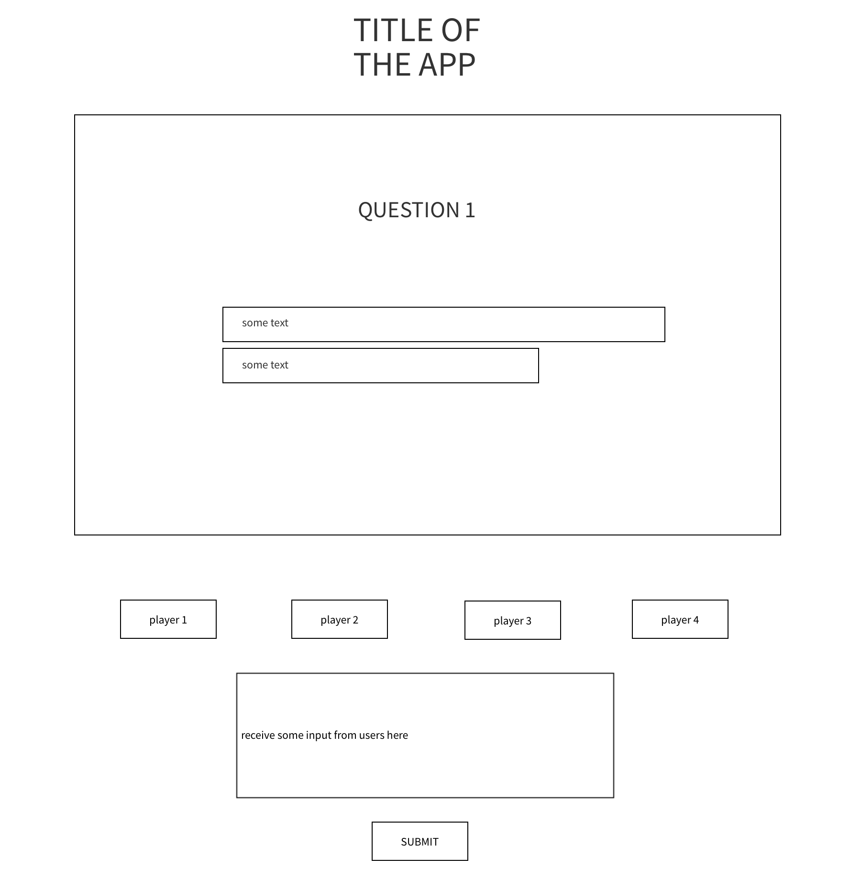
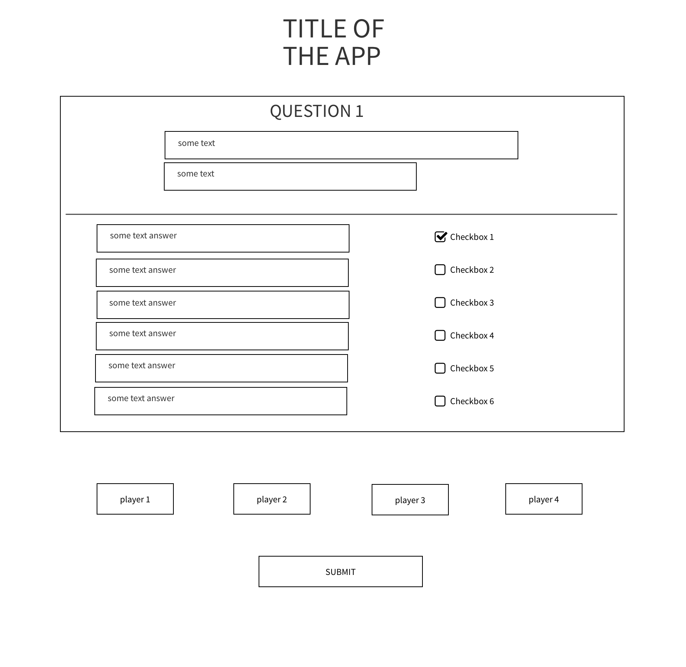
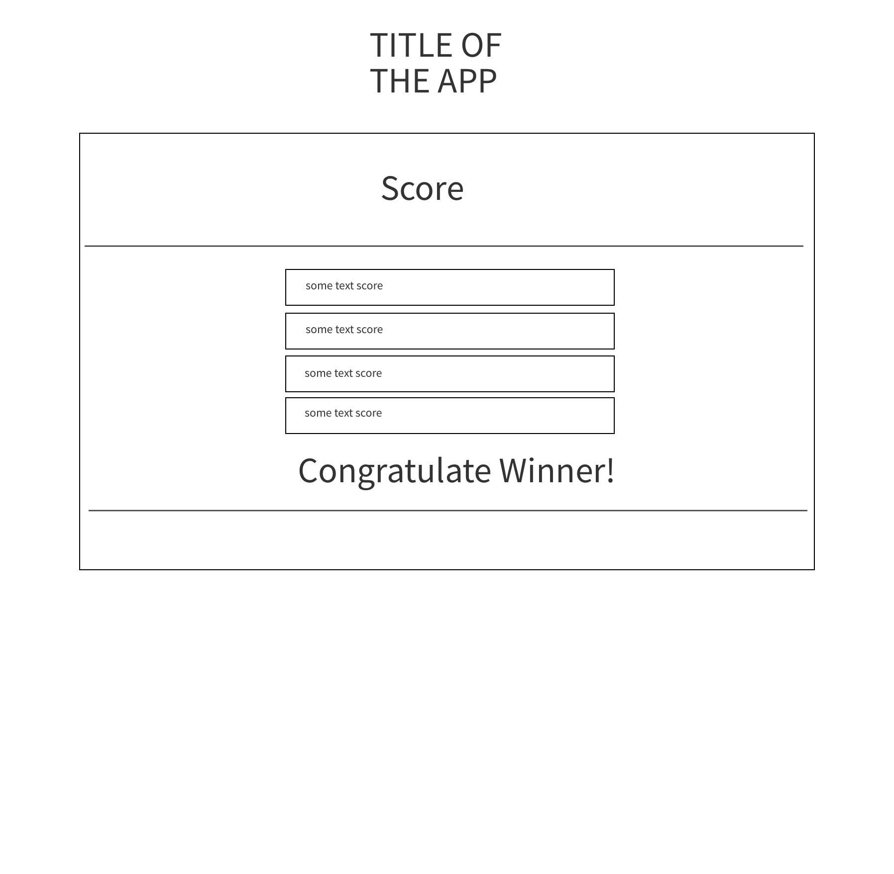
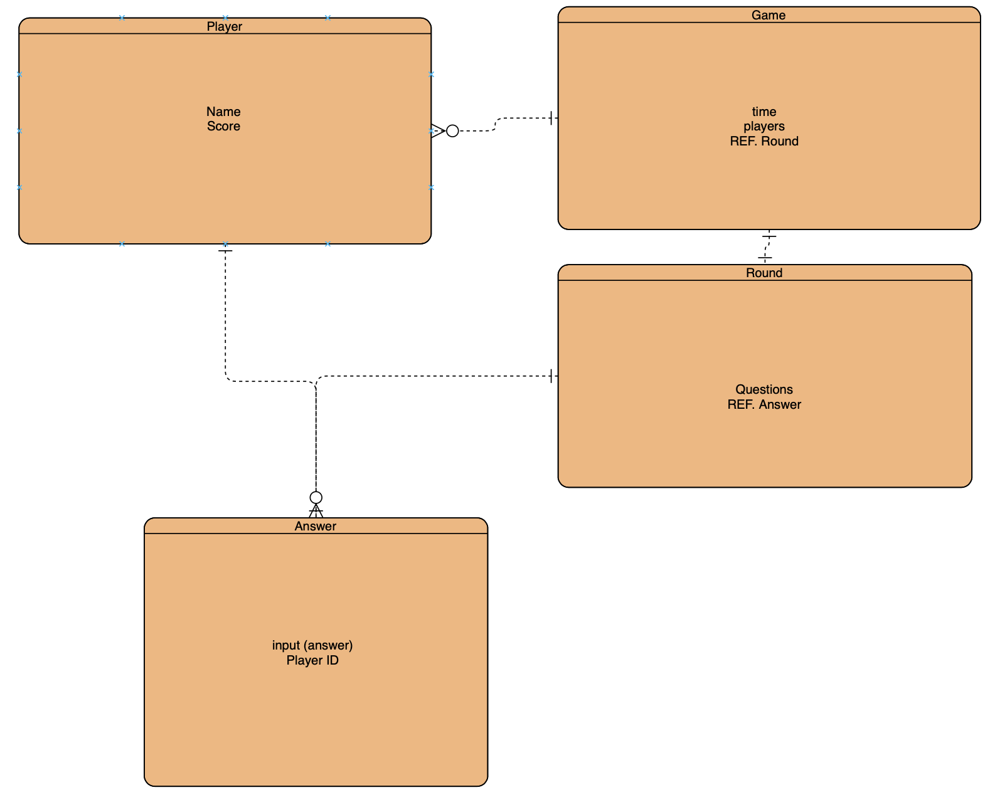

## Jacket Pocket

### Description

Full-stack App

### Technology Used

- MongoDB
- Express
- React
- Node
- Create React App 
- Mongoose
- Popmotion - POSE
- Semantic UI React
- Git
- Trello

### Wireframes

Available via the project wireframes folder

### Entity Relationship Diagram

Original available via the project wireframs folder (actual ERD may vary).

### User Story

Created for couch gamers in mind, interested in playing with friends from their web enabled devices. Dominate your opponent and see who can score the most points and set a new record.

Currently 1 player, 1 round without including sockets support for multiplayer gameplay.
- Input your name, input your answer to question, see the score and correct answer update, click restart deleting game and putting you back to input name.

### Supported Browsers

Chrome

### Git Repo 

Frontend (https://github.com/johnhill13/jacket-pocket)

Backend (https://github.com/johnhill13/jacket-pocket-backend)

### Deployed

https://jacket-pocket.herokuapp.com

### Future Features

- Multi-round funcitonality
- Scores and rounds tracked if user continues
- Socket (https://socket.io/docs/)
    - Library that enables real-time event-based communication
    - Create room for 4 players to join
- Multiple browsers supported
- Fix custom CSS
- Create your own question and answer pairs
- Ideas? Contributions? Create PR
